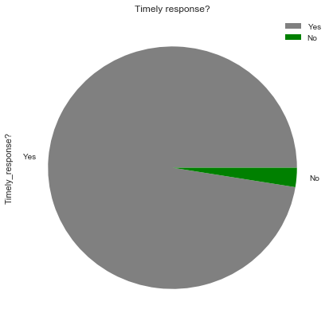
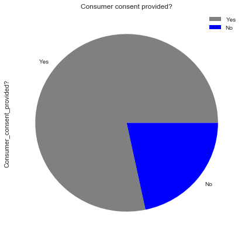
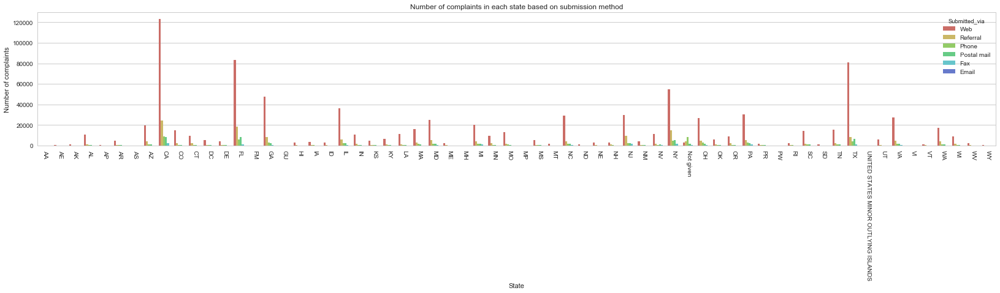
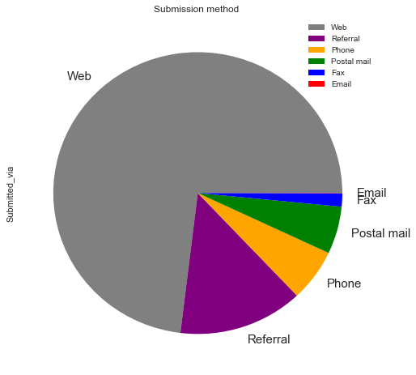
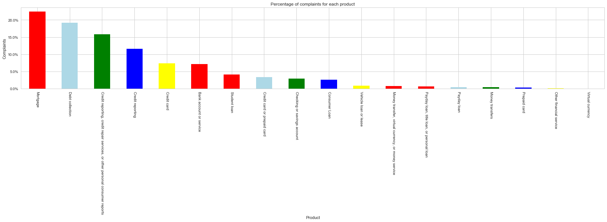
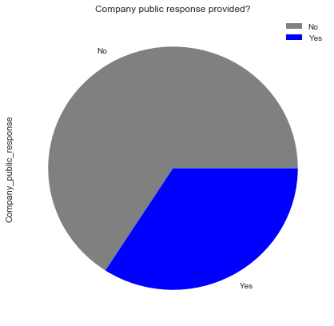
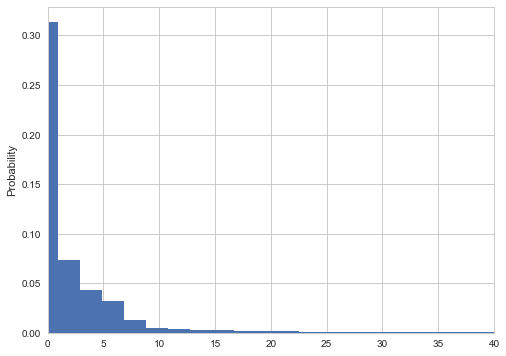

Here, I will clean data from Financial Services Consumer Complaint Database which is publicly avalable in this link: https://catalog.data.gov/dataset/consumer-complaint-database#topic=consumer_navigation. As described in this webpage, it contains "data from the complaints received by the Consumer Financial Protection Bureau (CFPB) on financial products and services, including bank accounts, credit cards, credit reporting, debt collection, money transfers, mortgages, student loans, and other types of consumer credit. Data available about each complaint includes the name of the provider, type of complaint, date, zip code, and other information."


## Data cleaning


```python
import pandas as pd
import numpy as np
import os
df = pd.read_csv("/Users/hossein/Consumer_Complaints/Consumer_Complaints.csv")
```

    /Users/hossein/anaconda3/lib/python3.6/site-packages/IPython/core/interactiveshell.py:2698: DtypeWarning: Columns (5,6,11,16) have mixed types. Specify dtype option on import or set low_memory=False.
      interactivity=interactivity, compiler=compiler, result=result)


```python
df.head()

```


<div>
<style scoped>
    .dataframe tbody tr th:only-of-type {
        vertical-align: middle;
    }

    .dataframe tbody tr th {
        vertical-align: top;
    }

    .dataframe thead th {
        text-align: right;
    }
</style>
<table border="1" class="dataframe">
  <thead>
    <tr style="text-align: right;">
      <th></th>
      <th>Date received</th>
      <th>Product</th>
      <th>Sub-product</th>
      <th>Issue</th>
      <th>Sub-issue</th>
      <th>Consumer complaint narrative</th>
      <th>Company public response</th>
      <th>Company</th>
      <th>State</th>
      <th>ZIP code</th>
      <th>Tags</th>
      <th>Consumer consent provided?</th>
      <th>Submitted via</th>
      <th>Date sent to company</th>
      <th>Company response to consumer</th>
      <th>Timely response?</th>
      <th>Consumer disputed?</th>
      <th>Complaint ID</th>
    </tr>
  </thead>
  <tbody>
    <tr>
      <th>0</th>
      <td>02/04/2019</td>
      <td>Credit card or prepaid card</td>
      <td>General-purpose credit card or charge card</td>
      <td>Getting a credit card</td>
      <td>Sent card you never applied for</td>
      <td>NaN</td>
      <td>Company believes it acted appropriately as aut...</td>
      <td>First Federal Credit Control</td>
      <td>FL</td>
      <td>NaN</td>
      <td>NaN</td>
      <td>NaN</td>
      <td>Web</td>
      <td>02/04/2019</td>
      <td>Closed with explanation</td>
      <td>Yes</td>
      <td>NaN</td>
      <td>3141563</td>
    </tr>
    <tr>
      <th>1</th>
      <td>02/04/2019</td>
      <td>Debt collection</td>
      <td>Payday loan debt</td>
      <td>False statements or representation</td>
      <td>Attempted to collect wrong amount</td>
      <td>NaN</td>
      <td>NaN</td>
      <td>ONEMAIN FINANCIAL HOLDINGS, LLC.</td>
      <td>MI</td>
      <td>NaN</td>
      <td>Older American</td>
      <td>NaN</td>
      <td>Web</td>
      <td>02/04/2019</td>
      <td>In progress</td>
      <td>Yes</td>
      <td>NaN</td>
      <td>3141667</td>
    </tr>
    <tr>
      <th>2</th>
      <td>02/04/2019</td>
      <td>Credit reporting, credit repair services, or o...</td>
      <td>Credit reporting</td>
      <td>Incorrect information on your report</td>
      <td>Information belongs to someone else</td>
      <td>NaN</td>
      <td>NaN</td>
      <td>NCC Business Services, Inc.</td>
      <td>TX</td>
      <td>NaN</td>
      <td>NaN</td>
      <td>NaN</td>
      <td>Web</td>
      <td>02/04/2019</td>
      <td>In progress</td>
      <td>Yes</td>
      <td>NaN</td>
      <td>3142226</td>
    </tr>
    <tr>
      <th>3</th>
      <td>02/04/2019</td>
      <td>Mortgage</td>
      <td>Conventional home mortgage</td>
      <td>Struggling to pay mortgage</td>
      <td>NaN</td>
      <td>NaN</td>
      <td>NaN</td>
      <td>BAYVIEW LOAN SERVICING, LLC</td>
      <td>CA</td>
      <td>NaN</td>
      <td>NaN</td>
      <td>Other</td>
      <td>Web</td>
      <td>02/04/2019</td>
      <td>In progress</td>
      <td>Yes</td>
      <td>NaN</td>
      <td>3142610</td>
    </tr>
    <tr>
      <th>4</th>
      <td>02/04/2019</td>
      <td>Debt collection</td>
      <td>I do not know</td>
      <td>Attempts to collect debt not owed</td>
      <td>Debt was paid</td>
      <td>NaN</td>
      <td>NaN</td>
      <td>Diversified Consultants, Inc.</td>
      <td>OH</td>
      <td>45044</td>
      <td>NaN</td>
      <td>NaN</td>
      <td>Web</td>
      <td>02/04/2019</td>
      <td>In progress</td>
      <td>Yes</td>
      <td>NaN</td>
      <td>3141862</td>
    </tr>
  </tbody>
</table>
</div>


```python
df.shape
```


    (1210607, 18)


```python
df.info()
```

    <class 'pandas.core.frame.DataFrame'>
    RangeIndex: 1210607 entries, 0 to 1210606
    Data columns (total 18 columns):
    Date received                   1210607 non-null object
    Product                         1210607 non-null object
    Sub-product                     975441 non-null object
    Issue                           1210607 non-null object
    Sub-issue                       688720 non-null object
    Consumer complaint narrative    364203 non-null object
    Company public response         413021 non-null object
    Company                         1210607 non-null object
    State                           1193509 non-null object
    ZIP code                        1105732 non-null object
    Tags                            165229 non-null object
    Consumer consent provided?      645754 non-null object
    Submitted via                   1210607 non-null object
    Date sent to company            1210607 non-null object
    Company response to consumer    1210601 non-null object
    Timely response?                1210607 non-null object
    Consumer disputed?              768520 non-null object
    Complaint ID                    1210607 non-null int64
    dtypes: int64(1), object(17)
    memory usage: 166.3+ MB


```python
df.isnull().sum()
```


    Date received                         0
    Product                               0
    Sub-product                      235166
    Issue                                 0
    Sub-issue                        521887
    Consumer complaint narrative     846404
    Company public response          797586
    Company                               0
    State                             17098
    ZIP code                         104875
    Tags                            1045378
    Consumer consent provided?       564853
    Submitted via                         0
    Date sent to company                  0
    Company response to consumer          6
    Timely response?                      0
    Consumer disputed?               442087
    Complaint ID                          0
    dtype: int64


```python
df["Date received"] = pd.to_datetime(df["Date received"])
df['Date sent to company'] = pd.to_datetime(df['Date sent to company'])

```


```python
def convert_type_to_int(val):
    """
    Convert the type from object to int
    """
    return int(val)


df['Complaint ID'].apply(convert_type_to_int)

```


```python
df["Timely response?"] = np.where(df["Timely response?"] == "Yes", True, False)
df["Consumer disputed?"] = np.where(df["Consumer disputed?"] == "Yes", True, False)
df["Consumer consent provided?"] = np.where(df["Consumer consent provided?"] == "Consent not provided", False, True)
```


```python
def replace_ZIP_code_XX(x):
    '''
    Replace XX in Zip code to 00
    '''
    try: 
        return x.replace('XX', '00').replace('(','').replace('"','').replace('-','').replace('$','').replace('.','').replace('!','').replace('+','').replace('*','').replace('`','').replace('/','')
    except AttributeError:
        return np.NaN

df['ZIP code'] = df['ZIP code'].map(replace_ZIP_code_XX)

```


```python
df.dtypes.to_frame(name='Type')
```


<div>
<style scoped>
    .dataframe tbody tr th:only-of-type {
        vertical-align: middle;
    }

    .dataframe tbody tr th {
        vertical-align: top;
    }

    .dataframe thead th {
        text-align: right;
    }
</style>
<table border="1" class="dataframe">
  <thead>
    <tr style="text-align: right;">
      <th></th>
      <th>Type</th>
    </tr>
  </thead>
  <tbody>
    <tr>
      <th>Date received</th>
      <td>datetime64[ns]</td>
    </tr>
    <tr>
      <th>Product</th>
      <td>object</td>
    </tr>
    <tr>
      <th>Sub-product</th>
      <td>object</td>
    </tr>
    <tr>
      <th>Issue</th>
      <td>object</td>
    </tr>
    <tr>
      <th>Sub-issue</th>
      <td>object</td>
    </tr>
    <tr>
      <th>Consumer complaint narrative</th>
      <td>object</td>
    </tr>
    <tr>
      <th>Company public response</th>
      <td>object</td>
    </tr>
    <tr>
      <th>Company</th>
      <td>object</td>
    </tr>
    <tr>
      <th>State</th>
      <td>object</td>
    </tr>
    <tr>
      <th>ZIP code</th>
      <td>object</td>
    </tr>
    <tr>
      <th>Tags</th>
      <td>object</td>
    </tr>
    <tr>
      <th>Consumer consent provided?</th>
      <td>bool</td>
    </tr>
    <tr>
      <th>Submitted via</th>
      <td>object</td>
    </tr>
    <tr>
      <th>Date sent to company</th>
      <td>datetime64[ns]</td>
    </tr>
    <tr>
      <th>Company response to consumer</th>
      <td>object</td>
    </tr>
    <tr>
      <th>Timely response?</th>
      <td>bool</td>
    </tr>
    <tr>
      <th>Consumer disputed?</th>
      <td>bool</td>
    </tr>
    <tr>
      <th>Complaint ID</th>
      <td>int64</td>
    </tr>
  </tbody>
</table>
</div>


```python
df.info()
```

    <class 'pandas.core.frame.DataFrame'>
    RangeIndex: 1210607 entries, 0 to 1210606
    Data columns (total 18 columns):
    Date received                   1210607 non-null datetime64[ns]
    Product                         1210607 non-null object
    Sub-product                     975441 non-null object
    Issue                           1210607 non-null object
    Sub-issue                       688720 non-null object
    Consumer complaint narrative    364203 non-null object
    Company public response         413021 non-null object
    Company                         1210607 non-null object
    State                           1193509 non-null object
    ZIP code                        1105732 non-null object
    Tags                            165229 non-null object
    Consumer consent provided?      1210607 non-null bool
    Submitted via                   1210607 non-null object
    Date sent to company            1210607 non-null datetime64[ns]
    Company response to consumer    1210601 non-null object
    Timely response?                1210607 non-null bool
    Consumer disputed?              1210607 non-null bool
    Complaint ID                    1210607 non-null int64
    dtypes: bool(3), datetime64[ns](2), int64(1), object(12)
    memory usage: 142.0+ MB


```python
df2 = df
```


```python
df2['ZIP code'] = df2['ZIP code'].fillna("00000").astype(int)
df2['State'] = df2['State'].fillna("Not given")
df2['Product'] = df2['Product'].fillna("Not given")
df2['Sub-product'] = df2['Sub-product'].fillna("Not given")
df2['Issue'] = df2['Issue'].fillna("Not given")
df2['Sub-issue'] = df2['Sub-issue'].fillna("Not given")
df2['Consumer complaint narrative'] = df2['Consumer complaint narrative'].fillna("Not given")
df2['Company public response'] = df2['Company public response'].fillna("Not given")
df2['Company response to consumer'] = df2['Company response to consumer'].fillna("Not given")
df2['Tags'] = df2['Tags'].fillna("Not given")
```


```python
df2.dtypes
```


    Date received                   datetime64[ns]
    Product                                 object
    Sub-product                             object
    Issue                                   object
    Sub-issue                               object
    Consumer complaint narrative            object
    Company public response                 object
    Company                                 object
    State                                   object
    ZIP code                                 int64
    Tags                                    object
    Consumer consent provided?                bool
    Submitted via                           object
    Date sent to company            datetime64[ns]
    Company response to consumer            object
    Timely response?                          bool
    Consumer disputed?                        bool
    Complaint ID                             int64
    dtype: object


```python
df2.iloc[:500]
```


<div>
<style scoped>
    .dataframe tbody tr th:only-of-type {
        vertical-align: middle;
    }

    .dataframe tbody tr th {
        vertical-align: top;
    }

    .dataframe thead th {
        text-align: right;
    }
</style>
<table border="1" class="dataframe">
  <thead>
    <tr style="text-align: right;">
      <th></th>
      <th>Date received</th>
      <th>Product</th>
      <th>Sub-product</th>
      <th>Issue</th>
      <th>Sub-issue</th>
      <th>Consumer complaint narrative</th>
      <th>Company public response</th>
      <th>Company</th>
      <th>State</th>
      <th>ZIP code</th>
      <th>Tags</th>
      <th>Consumer consent provided?</th>
      <th>Submitted via</th>
      <th>Date sent to company</th>
      <th>Company response to consumer</th>
      <th>Timely response?</th>
      <th>Consumer disputed?</th>
      <th>Complaint ID</th>
    </tr>
  </thead>
  <tbody>
    <tr>
      <th>0</th>
      <td>2019-02-04</td>
      <td>Credit card or prepaid card</td>
      <td>General-purpose credit card or charge card</td>
      <td>Getting a credit card</td>
      <td>Sent card you never applied for</td>
      <td>Not given</td>
      <td>Company believes it acted appropriately as aut...</td>
      <td>First Federal Credit Control</td>
      <td>FL</td>
      <td>0</td>
      <td>Not given</td>
      <td>True</td>
      <td>Web</td>
      <td>2019-02-04</td>
      <td>Closed with explanation</td>
      <td>True</td>
      <td>False</td>
      <td>3141563</td>
    </tr>
    <tr>
      <th>1</th>
      <td>2019-02-04</td>
      <td>Debt collection</td>
      <td>Payday loan debt</td>
      <td>False statements or representation</td>
      <td>Attempted to collect wrong amount</td>
      <td>Not given</td>
      <td>Not given</td>
      <td>ONEMAIN FINANCIAL HOLDINGS, LLC.</td>
      <td>MI</td>
      <td>0</td>
      <td>Older American</td>
      <td>True</td>
      <td>Web</td>
      <td>2019-02-04</td>
      <td>In progress</td>
      <td>True</td>
      <td>False</td>
      <td>3141667</td>
    </tr>
    <tr>
      <th>2</th>
      <td>2019-02-04</td>
      <td>Credit reporting, credit repair services, or o...</td>
      <td>Credit reporting</td>
      <td>Incorrect information on your report</td>
      <td>Information belongs to someone else</td>
      <td>Not given</td>
      <td>Not given</td>
      <td>NCC Business Services, Inc.</td>
      <td>TX</td>
      <td>0</td>
      <td>Not given</td>
      <td>True</td>
      <td>Web</td>
      <td>2019-02-04</td>
      <td>In progress</td>
      <td>True</td>
      <td>False</td>
      <td>3142226</td>
    </tr>
    <tr>
      <th>3</th>
      <td>2019-02-04</td>
      <td>Mortgage</td>
      <td>Conventional home mortgage</td>
      <td>Struggling to pay mortgage</td>
      <td>Not given</td>
      <td>Not given</td>
      <td>Not given</td>
      <td>BAYVIEW LOAN SERVICING, LLC</td>
      <td>CA</td>
      <td>0</td>
      <td>Not given</td>
      <td>True</td>
      <td>Web</td>
      <td>2019-02-04</td>
      <td>In progress</td>
      <td>True</td>
      <td>False</td>
      <td>3142610</td>
    </tr>
    <tr>
      <th>4</th>
      <td>2019-02-04</td>
      <td>Debt collection</td>
      <td>I do not know</td>
      <td>Attempts to collect debt not owed</td>
      <td>Debt was paid</td>
      <td>Not given</td>
      <td>Not given</td>
      <td>Diversified Consultants, Inc.</td>
      <td>OH</td>
      <td>45044</td>
      <td>Not given</td>
      <td>True</td>
      <td>Web</td>
      <td>2019-02-04</td>
      <td>In progress</td>
      <td>True</td>
      <td>False</td>
      <td>3141862</td>
    </tr>
    <tr>
      <th>5</th>
      <td>2019-02-04</td>
      <td>Money transfer, virtual currency, or money ser...</td>
      <td>International money transfer</td>
      <td>Fraud or scam</td>
      <td>Not given</td>
      <td>Not given</td>
      <td>Not given</td>
      <td>RIA FINANCIAL</td>
      <td>CA</td>
      <td>95112</td>
      <td>Servicemember</td>
      <td>True</td>
      <td>Web</td>
      <td>2019-02-04</td>
      <td>In progress</td>
      <td>True</td>
      <td>False</td>
      <td>3141648</td>
    </tr>
    <tr>
      <th>6</th>
      <td>2019-02-04</td>
      <td>Debt collection</td>
      <td>Other debt</td>
      <td>Communication tactics</td>
      <td>Frequent or repeated calls</td>
      <td>Not given</td>
      <td>Not given</td>
      <td>Diversified Consultants, Inc.</td>
      <td>AK</td>
      <td>99500</td>
      <td>Servicemember</td>
      <td>True</td>
      <td>Web</td>
      <td>2019-02-04</td>
      <td>In progress</td>
      <td>True</td>
      <td>False</td>
      <td>3141556</td>
    </tr>
    <tr>
      <th>7</th>
      <td>2019-02-04</td>
      <td>Credit reporting, credit repair services, or o...</td>
      <td>Credit reporting</td>
      <td>Incorrect information on your report</td>
      <td>Information belongs to someone else</td>
      <td>Not given</td>
      <td>Not given</td>
      <td>Diversified Consultants, Inc.</td>
      <td>IN</td>
      <td>46227</td>
      <td>Not given</td>
      <td>True</td>
      <td>Web</td>
      <td>2019-02-04</td>
      <td>In progress</td>
      <td>True</td>
      <td>False</td>
      <td>3141673</td>
    </tr>
    <tr>
      <th>8</th>
      <td>2019-02-04</td>
      <td>Debt collection</td>
      <td>Other debt</td>
      <td>Written notification about debt</td>
      <td>Didn't receive enough information to verify debt</td>
      <td>Not given</td>
      <td>Not given</td>
      <td>Diversified Consultants, Inc.</td>
      <td>PA</td>
      <td>19132</td>
      <td>Not given</td>
      <td>True</td>
      <td>Web</td>
      <td>2019-02-04</td>
      <td>In progress</td>
      <td>True</td>
      <td>False</td>
      <td>3142319</td>
    </tr>
    <tr>
      <th>9</th>
      <td>2019-02-03</td>
      <td>Mortgage</td>
      <td>FHA mortgage</td>
      <td>Struggling to pay mortgage</td>
      <td>Not given</td>
      <td>Not given</td>
      <td>Company has responded to the consumer and the ...</td>
      <td>WELLS FARGO &amp; COMPANY</td>
      <td>TX</td>
      <td>77400</td>
      <td>Not given</td>
      <td>True</td>
      <td>Web</td>
      <td>2019-02-03</td>
      <td>Closed with explanation</td>
      <td>True</td>
      <td>False</td>
      <td>3141202</td>
    </tr>
    <tr>
      <th>10</th>
      <td>2019-02-03</td>
      <td>Credit reporting, credit repair services, or o...</td>
      <td>Credit reporting</td>
      <td>Problem with fraud alerts or security freezes</td>
      <td>Not given</td>
      <td>Not given</td>
      <td>Not given</td>
      <td>National Consumer Telecom &amp; Utilities Exchange...</td>
      <td>IN</td>
      <td>46200</td>
      <td>Not given</td>
      <td>True</td>
      <td>Web</td>
      <td>2019-02-03</td>
      <td>Closed with explanation</td>
      <td>True</td>
      <td>False</td>
      <td>3141225</td>
    </tr>
    <tr>
      <th>11</th>
      <td>2019-02-03</td>
      <td>Debt collection</td>
      <td>I do not know</td>
      <td>Written notification about debt</td>
      <td>Didn't receive notice of right to dispute</td>
      <td>Not given</td>
      <td>Not given</td>
      <td>AFNI INC.</td>
      <td>GA</td>
      <td>30200</td>
      <td>Not given</td>
      <td>True</td>
      <td>Web</td>
      <td>2019-02-03</td>
      <td>Closed with explanation</td>
      <td>True</td>
      <td>False</td>
      <td>3141271</td>
    </tr>
    <tr>
      <th>12</th>
      <td>2019-02-03</td>
      <td>Debt collection</td>
      <td>Other debt</td>
      <td>Written notification about debt</td>
      <td>Didn't receive enough information to verify debt</td>
      <td>Not given</td>
      <td>Not given</td>
      <td>Credit Bureau Services Association</td>
      <td>VA</td>
      <td>23400</td>
      <td>Servicemember</td>
      <td>True</td>
      <td>Web</td>
      <td>2019-02-03</td>
      <td>Closed with explanation</td>
      <td>True</td>
      <td>False</td>
      <td>3140977</td>
    </tr>
    <tr>
      <th>13</th>
      <td>2019-02-03</td>
      <td>Debt collection</td>
      <td>Auto debt</td>
      <td>Attempts to collect debt not owed</td>
      <td>Debt was result of identity theft</td>
      <td>Not given</td>
      <td>Not given</td>
      <td>NAVY FEDERAL CREDIT UNION</td>
      <td>NC</td>
      <td>28217</td>
      <td>Not given</td>
      <td>True</td>
      <td>Web</td>
      <td>2019-02-03</td>
      <td>In progress</td>
      <td>True</td>
      <td>False</td>
      <td>3141273</td>
    </tr>
    <tr>
      <th>14</th>
      <td>2019-02-03</td>
      <td>Credit reporting, credit repair services, or o...</td>
      <td>Credit reporting</td>
      <td>Incorrect information on your report</td>
      <td>Information belongs to someone else</td>
      <td>Not given</td>
      <td>Not given</td>
      <td>EQUIFAX, INC.</td>
      <td>FL</td>
      <td>33619</td>
      <td>Not given</td>
      <td>True</td>
      <td>Web</td>
      <td>2019-02-03</td>
      <td>Closed with explanation</td>
      <td>True</td>
      <td>False</td>
      <td>3141177</td>
    </tr>
    <tr>
      <th>15</th>
      <td>2019-02-03</td>
      <td>Credit reporting, credit repair services, or o...</td>
      <td>Credit reporting</td>
      <td>Problem with a credit reporting company's inve...</td>
      <td>Their investigation did not fix an error on yo...</td>
      <td>Not given</td>
      <td>Not given</td>
      <td>EQUIFAX, INC.</td>
      <td>TX</td>
      <td>77084</td>
      <td>Not given</td>
      <td>True</td>
      <td>Web</td>
      <td>2019-02-03</td>
      <td>Closed with explanation</td>
      <td>True</td>
      <td>False</td>
      <td>3141184</td>
    </tr>
    <tr>
      <th>16</th>
      <td>2019-02-03</td>
      <td>Credit reporting, credit repair services, or o...</td>
      <td>Credit reporting</td>
      <td>Incorrect information on your report</td>
      <td>Account status incorrect</td>
      <td>Not given</td>
      <td>Not given</td>
      <td>Unisa, Inc</td>
      <td>CO</td>
      <td>80000</td>
      <td>Not given</td>
      <td>True</td>
      <td>Web</td>
      <td>2019-02-03</td>
      <td>Closed with explanation</td>
      <td>True</td>
      <td>False</td>
      <td>3141337</td>
    </tr>
    <tr>
      <th>17</th>
      <td>2019-02-02</td>
      <td>Debt collection</td>
      <td>Other debt</td>
      <td>Attempts to collect debt not owed</td>
      <td>Debt is not yours</td>
      <td>Not given</td>
      <td>Company believes it acted appropriately as aut...</td>
      <td>Professional Recovery Management</td>
      <td>TN</td>
      <td>37100</td>
      <td>Not given</td>
      <td>True</td>
      <td>Web</td>
      <td>2019-02-02</td>
      <td>Closed with explanation</td>
      <td>True</td>
      <td>False</td>
      <td>3140743</td>
    </tr>
    <tr>
      <th>18</th>
      <td>2019-02-02</td>
      <td>Credit reporting, credit repair services, or o...</td>
      <td>Credit reporting</td>
      <td>Improper use of your report</td>
      <td>Credit inquiries on your report that you don't...</td>
      <td>Not given</td>
      <td>Not given</td>
      <td>Informative Research</td>
      <td>FL</td>
      <td>32900</td>
      <td>Servicemember</td>
      <td>True</td>
      <td>Web</td>
      <td>2019-02-02</td>
      <td>Closed with explanation</td>
      <td>True</td>
      <td>False</td>
      <td>3140742</td>
    </tr>
    <tr>
      <th>19</th>
      <td>2019-02-02</td>
      <td>Debt collection</td>
      <td>Other debt</td>
      <td>Attempts to collect debt not owed</td>
      <td>Debt was paid</td>
      <td>Not given</td>
      <td>Company has responded to the consumer and the ...</td>
      <td>Convergent Resources, Inc.</td>
      <td>MI</td>
      <td>48000</td>
      <td>Not given</td>
      <td>True</td>
      <td>Web</td>
      <td>2019-02-02</td>
      <td>Closed with explanation</td>
      <td>True</td>
      <td>False</td>
      <td>3140620</td>
    </tr>
    <tr>
      <th>20</th>
      <td>2019-02-02</td>
      <td>Mortgage</td>
      <td>Conventional home mortgage</td>
      <td>Trouble during payment process</td>
      <td>Not given</td>
      <td>Not given</td>
      <td>Company has responded to the consumer and the ...</td>
      <td>FREEDOM MORTGAGE COMPANY</td>
      <td>CO</td>
      <td>80306</td>
      <td>Not given</td>
      <td>False</td>
      <td>Web</td>
      <td>2019-02-02</td>
      <td>Closed with explanation</td>
      <td>True</td>
      <td>False</td>
      <td>3140492</td>
    </tr>
    <tr>
      <th>21</th>
      <td>2019-02-02</td>
      <td>Student loan</td>
      <td>Federal student loan servicing</td>
      <td>Dealing with your lender or servicer</td>
      <td>Trouble with how payments are being handled</td>
      <td>Not given</td>
      <td>Not given</td>
      <td>AES/PHEAA</td>
      <td>CA</td>
      <td>93700</td>
      <td>Not given</td>
      <td>True</td>
      <td>Web</td>
      <td>2019-02-02</td>
      <td>Closed with explanation</td>
      <td>True</td>
      <td>False</td>
      <td>3140550</td>
    </tr>
    <tr>
      <th>22</th>
      <td>2019-02-02</td>
      <td>Credit reporting, credit repair services, or o...</td>
      <td>Credit reporting</td>
      <td>Incorrect information on your report</td>
      <td>Account information incorrect</td>
      <td>Not given</td>
      <td>Not given</td>
      <td>BAYVIEW LOAN SERVICING, LLC</td>
      <td>OH</td>
      <td>0</td>
      <td>Not given</td>
      <td>True</td>
      <td>Web</td>
      <td>2019-02-02</td>
      <td>In progress</td>
      <td>True</td>
      <td>False</td>
      <td>3140728</td>
    </tr>
    <tr>
      <th>23</th>
      <td>2019-02-02</td>
      <td>Credit reporting, credit repair services, or o...</td>
      <td>Credit reporting</td>
      <td>Incorrect information on your report</td>
      <td>Information belongs to someone else</td>
      <td>Not given</td>
      <td>Not given</td>
      <td>United Check Recovery Bureau, Inc.</td>
      <td>TX</td>
      <td>76500</td>
      <td>Servicemember</td>
      <td>True</td>
      <td>Web</td>
      <td>2019-02-02</td>
      <td>In progress</td>
      <td>True</td>
      <td>False</td>
      <td>3140788</td>
    </tr>
    <tr>
      <th>24</th>
      <td>2019-02-02</td>
      <td>Debt collection</td>
      <td>I do not know</td>
      <td>Attempts to collect debt not owed</td>
      <td>Debt was result of identity theft</td>
      <td>Not given</td>
      <td>Not given</td>
      <td>Diversified Consultants, Inc.</td>
      <td>CA</td>
      <td>91344</td>
      <td>Not given</td>
      <td>True</td>
      <td>Web</td>
      <td>2019-02-02</td>
      <td>In progress</td>
      <td>True</td>
      <td>False</td>
      <td>3140642</td>
    </tr>
    <tr>
      <th>25</th>
      <td>2019-02-02</td>
      <td>Vehicle loan or lease</td>
      <td>Loan</td>
      <td>Managing the loan or lease</td>
      <td>Problem with additional products or services p...</td>
      <td>Not given</td>
      <td>Not given</td>
      <td>ALLY FINANCIAL INC.</td>
      <td>AL</td>
      <td>35100</td>
      <td>Not given</td>
      <td>True</td>
      <td>Web</td>
      <td>2019-02-02</td>
      <td>In progress</td>
      <td>True</td>
      <td>False</td>
      <td>3140936</td>
    </tr>
    <tr>
      <th>26</th>
      <td>2019-02-02</td>
      <td>Checking or savings account</td>
      <td>Checking account</td>
      <td>Managing an account</td>
      <td>Deposits and withdrawals</td>
      <td>Not given</td>
      <td>Not given</td>
      <td>NAVY FEDERAL CREDIT UNION</td>
      <td>PA</td>
      <td>19100</td>
      <td>Not given</td>
      <td>True</td>
      <td>Web</td>
      <td>2019-02-02</td>
      <td>In progress</td>
      <td>True</td>
      <td>False</td>
      <td>3140687</td>
    </tr>
    <tr>
      <th>27</th>
      <td>2019-02-02</td>
      <td>Credit reporting, credit repair services, or o...</td>
      <td>Credit reporting</td>
      <td>Improper use of your report</td>
      <td>Credit inquiries on your report that you don't...</td>
      <td>Not given</td>
      <td>Not given</td>
      <td>ALLY FINANCIAL INC.</td>
      <td>CA</td>
      <td>94900</td>
      <td>Not given</td>
      <td>True</td>
      <td>Web</td>
      <td>2019-02-02</td>
      <td>In progress</td>
      <td>True</td>
      <td>False</td>
      <td>3140617</td>
    </tr>
    <tr>
      <th>28</th>
      <td>2019-02-02</td>
      <td>Payday loan, title loan, or personal loan</td>
      <td>Installment loan</td>
      <td>Problem with the payoff process at the end of ...</td>
      <td>Not given</td>
      <td>Not given</td>
      <td>Not given</td>
      <td>NAVY FEDERAL CREDIT UNION</td>
      <td>CA</td>
      <td>92500</td>
      <td>Servicemember</td>
      <td>True</td>
      <td>Web</td>
      <td>2019-02-02</td>
      <td>In progress</td>
      <td>True</td>
      <td>False</td>
      <td>3140882</td>
    </tr>
    <tr>
      <th>29</th>
      <td>2019-02-02</td>
      <td>Money transfer, virtual currency, or money ser...</td>
      <td>Domestic (US) money transfer</td>
      <td>Other transaction problem</td>
      <td>Not given</td>
      <td>Not given</td>
      <td>Not given</td>
      <td>MONEYGRAM PAYMENT SYSTEMS WORLDWIDE INC</td>
      <td>Not given</td>
      <td>0</td>
      <td>Older American</td>
      <td>True</td>
      <td>Phone</td>
      <td>2019-02-04</td>
      <td>In progress</td>
      <td>True</td>
      <td>False</td>
      <td>3140398</td>
    </tr>
    <tr>
      <th>...</th>
      <td>...</td>
      <td>...</td>
      <td>...</td>
      <td>...</td>
      <td>...</td>
      <td>...</td>
      <td>...</td>
      <td>...</td>
      <td>...</td>
      <td>...</td>
      <td>...</td>
      <td>...</td>
      <td>...</td>
      <td>...</td>
      <td>...</td>
      <td>...</td>
      <td>...</td>
      <td>...</td>
    </tr>
    <tr>
      <th>470</th>
      <td>2019-01-28</td>
      <td>Credit reporting, credit repair services, or o...</td>
      <td>Credit reporting</td>
      <td>Incorrect information on your report</td>
      <td>Information belongs to someone else</td>
      <td>I am a victim of identity theft and I have bee...</td>
      <td>Company has responded to the consumer and the ...</td>
      <td>Ability Recovery Services, LLC</td>
      <td>GA</td>
      <td>30300</td>
      <td>Not given</td>
      <td>True</td>
      <td>Web</td>
      <td>2019-01-28</td>
      <td>Closed with explanation</td>
      <td>True</td>
      <td>False</td>
      <td>3134908</td>
    </tr>
    <tr>
      <th>471</th>
      <td>2019-01-28</td>
      <td>Credit reporting, credit repair services, or o...</td>
      <td>Credit reporting</td>
      <td>Problem with a credit reporting company's inve...</td>
      <td>Their investigation did not fix an error on yo...</td>
      <td>Not given</td>
      <td>Company has responded to the consumer and the ...</td>
      <td>Experian Information Solutions Inc.</td>
      <td>AL</td>
      <td>36330</td>
      <td>Not given</td>
      <td>False</td>
      <td>Web</td>
      <td>2019-01-28</td>
      <td>Closed with explanation</td>
      <td>True</td>
      <td>False</td>
      <td>3135502</td>
    </tr>
    <tr>
      <th>472</th>
      <td>2019-01-28</td>
      <td>Credit reporting, credit repair services, or o...</td>
      <td>Credit reporting</td>
      <td>Incorrect information on your report</td>
      <td>Account status incorrect</td>
      <td>Not given</td>
      <td>Company has responded to the consumer and the ...</td>
      <td>Experian Information Solutions Inc.</td>
      <td>FL</td>
      <td>32200</td>
      <td>Not given</td>
      <td>True</td>
      <td>Web</td>
      <td>2019-01-28</td>
      <td>Closed with non-monetary relief</td>
      <td>True</td>
      <td>False</td>
      <td>3134874</td>
    </tr>
    <tr>
      <th>473</th>
      <td>2019-01-28</td>
      <td>Credit reporting, credit repair services, or o...</td>
      <td>Credit reporting</td>
      <td>Incorrect information on your report</td>
      <td>Information is missing that should be on the r...</td>
      <td>Not given</td>
      <td>Not given</td>
      <td>Navient Solutions, LLC.</td>
      <td>VA</td>
      <td>23156</td>
      <td>Not given</td>
      <td>True</td>
      <td>Web</td>
      <td>2019-01-28</td>
      <td>Closed with explanation</td>
      <td>True</td>
      <td>False</td>
      <td>3135704</td>
    </tr>
    <tr>
      <th>474</th>
      <td>2019-01-28</td>
      <td>Credit reporting, credit repair services, or o...</td>
      <td>Credit reporting</td>
      <td>Incorrect information on your report</td>
      <td>Information belongs to someone else</td>
      <td>Not given</td>
      <td>Not given</td>
      <td>EQUIFAX, INC.</td>
      <td>TX</td>
      <td>77449</td>
      <td>Not given</td>
      <td>True</td>
      <td>Web</td>
      <td>2019-01-28</td>
      <td>Closed with explanation</td>
      <td>True</td>
      <td>False</td>
      <td>3135367</td>
    </tr>
    <tr>
      <th>475</th>
      <td>2019-01-28</td>
      <td>Debt collection</td>
      <td>I do not know</td>
      <td>False statements or representation</td>
      <td>Impersonated attorney, law enforcement, or gov...</td>
      <td>Not given</td>
      <td>Company can't verify or dispute the facts in t...</td>
      <td>CCS Financial Services, Inc.</td>
      <td>CA</td>
      <td>91413</td>
      <td>Not given</td>
      <td>False</td>
      <td>Web</td>
      <td>2019-02-01</td>
      <td>Closed with explanation</td>
      <td>True</td>
      <td>False</td>
      <td>3135225</td>
    </tr>
    <tr>
      <th>476</th>
      <td>2019-01-28</td>
      <td>Student loan</td>
      <td>Federal student loan servicing</td>
      <td>Dealing with your lender or servicer</td>
      <td>Trouble with how payments are being handled</td>
      <td>Not given</td>
      <td>Not given</td>
      <td>AES/PHEAA</td>
      <td>HI</td>
      <td>96700</td>
      <td>Servicemember</td>
      <td>True</td>
      <td>Web</td>
      <td>2019-01-29</td>
      <td>Closed with explanation</td>
      <td>True</td>
      <td>False</td>
      <td>3135656</td>
    </tr>
    <tr>
      <th>477</th>
      <td>2019-01-28</td>
      <td>Money transfer, virtual currency, or money ser...</td>
      <td>Check cashing service</td>
      <td>Problem with customer service</td>
      <td>Not given</td>
      <td>Not given</td>
      <td>Not given</td>
      <td>GLOBAL CLIENT SOLUTIONS, LLC</td>
      <td>TX</td>
      <td>77300</td>
      <td>Older American</td>
      <td>True</td>
      <td>Web</td>
      <td>2019-01-28</td>
      <td>Closed with explanation</td>
      <td>True</td>
      <td>False</td>
      <td>3135017</td>
    </tr>
    <tr>
      <th>478</th>
      <td>2019-01-28</td>
      <td>Credit reporting, credit repair services, or o...</td>
      <td>Credit reporting</td>
      <td>Incorrect information on your report</td>
      <td>Information belongs to someone else</td>
      <td>Not given</td>
      <td>Not given</td>
      <td>Experian Information Solutions Inc.</td>
      <td>GA</td>
      <td>30000</td>
      <td>Not given</td>
      <td>True</td>
      <td>Web</td>
      <td>2019-01-28</td>
      <td>In progress</td>
      <td>True</td>
      <td>False</td>
      <td>3135577</td>
    </tr>
    <tr>
      <th>479</th>
      <td>2019-01-28</td>
      <td>Debt collection</td>
      <td>Payday loan debt</td>
      <td>Attempts to collect debt not owed</td>
      <td>Debt was paid</td>
      <td>Not given</td>
      <td>Not given</td>
      <td>Ad Astra Recovery Services Inc</td>
      <td>TX</td>
      <td>75200</td>
      <td>Not given</td>
      <td>True</td>
      <td>Web</td>
      <td>2019-01-28</td>
      <td>Closed with explanation</td>
      <td>True</td>
      <td>False</td>
      <td>3135624</td>
    </tr>
    <tr>
      <th>480</th>
      <td>2019-01-28</td>
      <td>Checking or savings account</td>
      <td>Savings account</td>
      <td>Closing an account</td>
      <td>Funds not received from closed account</td>
      <td>Not given</td>
      <td>Not given</td>
      <td>BANK OF THE WEST</td>
      <td>CA</td>
      <td>93631</td>
      <td>Not given</td>
      <td>True</td>
      <td>Referral</td>
      <td>2019-01-29</td>
      <td>Closed with explanation</td>
      <td>True</td>
      <td>False</td>
      <td>3136175</td>
    </tr>
    <tr>
      <th>481</th>
      <td>2019-01-28</td>
      <td>Credit reporting, credit repair services, or o...</td>
      <td>Credit reporting</td>
      <td>Incorrect information on your report</td>
      <td>Information belongs to someone else</td>
      <td>Not given</td>
      <td>Company has responded to the consumer and the ...</td>
      <td>Experian Information Solutions Inc.</td>
      <td>CA</td>
      <td>90200</td>
      <td>Not given</td>
      <td>False</td>
      <td>Web</td>
      <td>2019-01-28</td>
      <td>Closed with explanation</td>
      <td>True</td>
      <td>False</td>
      <td>3135413</td>
    </tr>
    <tr>
      <th>482</th>
      <td>2019-01-28</td>
      <td>Credit reporting, credit repair services, or o...</td>
      <td>Credit reporting</td>
      <td>Incorrect information on your report</td>
      <td>Information belongs to someone else</td>
      <td>Not given</td>
      <td>Company has responded to the consumer and the ...</td>
      <td>Experian Information Solutions Inc.</td>
      <td>GA</td>
      <td>0</td>
      <td>Not given</td>
      <td>True</td>
      <td>Web</td>
      <td>2019-01-28</td>
      <td>Closed with non-monetary relief</td>
      <td>True</td>
      <td>False</td>
      <td>3134840</td>
    </tr>
    <tr>
      <th>483</th>
      <td>2019-01-28</td>
      <td>Mortgage</td>
      <td>Conventional home mortgage</td>
      <td>Trouble during payment process</td>
      <td>Not given</td>
      <td>Not given</td>
      <td>Not given</td>
      <td>BAYVIEW LOAN SERVICING, LLC</td>
      <td>CA</td>
      <td>90600</td>
      <td>Not given</td>
      <td>True</td>
      <td>Web</td>
      <td>2019-02-04</td>
      <td>In progress</td>
      <td>True</td>
      <td>False</td>
      <td>3134765</td>
    </tr>
    <tr>
      <th>484</th>
      <td>2019-01-28</td>
      <td>Credit reporting, credit repair services, or o...</td>
      <td>Credit reporting</td>
      <td>Incorrect information on your report</td>
      <td>Information belongs to someone else</td>
      <td>Not given</td>
      <td>Company has responded to the consumer and the ...</td>
      <td>Experian Information Solutions Inc.</td>
      <td>FL</td>
      <td>33000</td>
      <td>Not given</td>
      <td>True</td>
      <td>Web</td>
      <td>2019-01-28</td>
      <td>Closed with non-monetary relief</td>
      <td>True</td>
      <td>False</td>
      <td>3135103</td>
    </tr>
    <tr>
      <th>485</th>
      <td>2019-01-28</td>
      <td>Credit reporting, credit repair services, or o...</td>
      <td>Credit reporting</td>
      <td>Incorrect information on your report</td>
      <td>Information belongs to someone else</td>
      <td>Not given</td>
      <td>Company has responded to the consumer and the ...</td>
      <td>Experian Information Solutions Inc.</td>
      <td>FL</td>
      <td>33100</td>
      <td>Not given</td>
      <td>True</td>
      <td>Web</td>
      <td>2019-01-28</td>
      <td>Closed with non-monetary relief</td>
      <td>True</td>
      <td>False</td>
      <td>3134931</td>
    </tr>
    <tr>
      <th>486</th>
      <td>2019-01-28</td>
      <td>Credit reporting, credit repair services, or o...</td>
      <td>Credit reporting</td>
      <td>Incorrect information on your report</td>
      <td>Information belongs to someone else</td>
      <td>Not given</td>
      <td>Company has responded to the consumer and the ...</td>
      <td>Experian Information Solutions Inc.</td>
      <td>CA</td>
      <td>92100</td>
      <td>Servicemember</td>
      <td>True</td>
      <td>Web</td>
      <td>2019-01-28</td>
      <td>Closed with non-monetary relief</td>
      <td>True</td>
      <td>False</td>
      <td>3135257</td>
    </tr>
    <tr>
      <th>487</th>
      <td>2019-01-28</td>
      <td>Credit reporting, credit repair services, or o...</td>
      <td>Credit reporting</td>
      <td>Incorrect information on your report</td>
      <td>Public record information inaccurate</td>
      <td>Not given</td>
      <td>Company has responded to the consumer and the ...</td>
      <td>Experian Information Solutions Inc.</td>
      <td>MO</td>
      <td>0</td>
      <td>Not given</td>
      <td>True</td>
      <td>Web</td>
      <td>2019-01-28</td>
      <td>Closed with explanation</td>
      <td>True</td>
      <td>False</td>
      <td>3134810</td>
    </tr>
    <tr>
      <th>488</th>
      <td>2019-01-28</td>
      <td>Debt collection</td>
      <td>Auto debt</td>
      <td>False statements or representation</td>
      <td>Attempted to collect wrong amount</td>
      <td>Not given</td>
      <td>Company has responded to the consumer and the ...</td>
      <td>Avid Acceptance, LLC</td>
      <td>AZ</td>
      <td>85323</td>
      <td>Not given</td>
      <td>False</td>
      <td>Web</td>
      <td>2019-01-28</td>
      <td>Closed with explanation</td>
      <td>True</td>
      <td>False</td>
      <td>3134794</td>
    </tr>
    <tr>
      <th>489</th>
      <td>2019-01-28</td>
      <td>Credit reporting, credit repair services, or o...</td>
      <td>Credit reporting</td>
      <td>Incorrect information on your report</td>
      <td>Information belongs to someone else</td>
      <td>Not given</td>
      <td>Company has responded to the consumer and the ...</td>
      <td>Experian Information Solutions Inc.</td>
      <td>FL</td>
      <td>33000</td>
      <td>Not given</td>
      <td>True</td>
      <td>Web</td>
      <td>2019-01-28</td>
      <td>Closed with non-monetary relief</td>
      <td>True</td>
      <td>False</td>
      <td>3135439</td>
    </tr>
    <tr>
      <th>490</th>
      <td>2019-01-28</td>
      <td>Credit reporting, credit repair services, or o...</td>
      <td>Credit reporting</td>
      <td>Problem with a credit reporting company's inve...</td>
      <td>Their investigation did not fix an error on yo...</td>
      <td>Not given</td>
      <td>Not given</td>
      <td>Experian Information Solutions Inc.</td>
      <td>FL</td>
      <td>32900</td>
      <td>Not given</td>
      <td>True</td>
      <td>Web</td>
      <td>2019-01-28</td>
      <td>In progress</td>
      <td>True</td>
      <td>False</td>
      <td>3134801</td>
    </tr>
    <tr>
      <th>491</th>
      <td>2019-01-28</td>
      <td>Credit reporting, credit repair services, or o...</td>
      <td>Credit reporting</td>
      <td>Improper use of your report</td>
      <td>Received unsolicited financial product or insu...</td>
      <td>Not given</td>
      <td>Not given</td>
      <td>NAVY FEDERAL CREDIT UNION</td>
      <td>DC</td>
      <td>20010</td>
      <td>Not given</td>
      <td>True</td>
      <td>Phone</td>
      <td>2019-01-29</td>
      <td>In progress</td>
      <td>True</td>
      <td>False</td>
      <td>3135297</td>
    </tr>
    <tr>
      <th>492</th>
      <td>2019-01-28</td>
      <td>Credit reporting, credit repair services, or o...</td>
      <td>Credit reporting</td>
      <td>Problem with a credit reporting company's inve...</td>
      <td>Was not notified of investigation status or re...</td>
      <td>Not given</td>
      <td>Not given</td>
      <td>Experian Information Solutions Inc.</td>
      <td>FL</td>
      <td>33400</td>
      <td>Not given</td>
      <td>True</td>
      <td>Web</td>
      <td>2019-01-28</td>
      <td>In progress</td>
      <td>True</td>
      <td>False</td>
      <td>3135359</td>
    </tr>
    <tr>
      <th>493</th>
      <td>2019-01-28</td>
      <td>Credit reporting, credit repair services, or o...</td>
      <td>Credit reporting</td>
      <td>Incorrect information on your report</td>
      <td>Account information incorrect</td>
      <td>Not given</td>
      <td>Not given</td>
      <td>EQUIFAX, INC.</td>
      <td>TX</td>
      <td>77385</td>
      <td>Not given</td>
      <td>True</td>
      <td>Phone</td>
      <td>2019-01-29</td>
      <td>Closed with explanation</td>
      <td>True</td>
      <td>False</td>
      <td>3135064</td>
    </tr>
    <tr>
      <th>494</th>
      <td>2019-01-28</td>
      <td>Debt collection</td>
      <td>Credit card debt</td>
      <td>Attempts to collect debt not owed</td>
      <td>Debt was result of identity theft</td>
      <td>Not given</td>
      <td>Company believes it acted appropriately as aut...</td>
      <td>ERC</td>
      <td>CA</td>
      <td>91344</td>
      <td>Not given</td>
      <td>False</td>
      <td>Web</td>
      <td>2019-01-28</td>
      <td>Closed with explanation</td>
      <td>True</td>
      <td>False</td>
      <td>3135419</td>
    </tr>
    <tr>
      <th>495</th>
      <td>2019-01-28</td>
      <td>Credit reporting, credit repair services, or o...</td>
      <td>Credit reporting</td>
      <td>Problem with a credit reporting company's inve...</td>
      <td>Their investigation did not fix an error on yo...</td>
      <td>Not given</td>
      <td>Not given</td>
      <td>Experian Information Solutions Inc.</td>
      <td>TX</td>
      <td>78700</td>
      <td>Not given</td>
      <td>True</td>
      <td>Web</td>
      <td>2019-01-28</td>
      <td>In progress</td>
      <td>True</td>
      <td>False</td>
      <td>3135146</td>
    </tr>
    <tr>
      <th>496</th>
      <td>2019-01-28</td>
      <td>Student loan</td>
      <td>Private student loan</td>
      <td>Dealing with your lender or servicer</td>
      <td>Problem with customer service</td>
      <td>Not given</td>
      <td>Not given</td>
      <td>Navient Solutions, LLC.</td>
      <td>NY</td>
      <td>10562</td>
      <td>Not given</td>
      <td>True</td>
      <td>Web</td>
      <td>2019-01-28</td>
      <td>Closed with explanation</td>
      <td>True</td>
      <td>False</td>
      <td>3134994</td>
    </tr>
    <tr>
      <th>497</th>
      <td>2019-01-28</td>
      <td>Credit reporting, credit repair services, or o...</td>
      <td>Credit reporting</td>
      <td>Problem with a credit reporting company's inve...</td>
      <td>Their investigation did not fix an error on yo...</td>
      <td>Not given</td>
      <td>Not given</td>
      <td>Experian Information Solutions Inc.</td>
      <td>CA</td>
      <td>0</td>
      <td>Not given</td>
      <td>True</td>
      <td>Web</td>
      <td>2019-01-28</td>
      <td>In progress</td>
      <td>True</td>
      <td>False</td>
      <td>3134845</td>
    </tr>
    <tr>
      <th>498</th>
      <td>2019-01-28</td>
      <td>Student loan</td>
      <td>Federal student loan servicing</td>
      <td>Dealing with your lender or servicer</td>
      <td>Received bad information about your loan</td>
      <td>Not given</td>
      <td>Not given</td>
      <td>Navient Solutions, LLC.</td>
      <td>IL</td>
      <td>0</td>
      <td>Not given</td>
      <td>True</td>
      <td>Web</td>
      <td>2019-01-28</td>
      <td>Closed with explanation</td>
      <td>True</td>
      <td>False</td>
      <td>3135706</td>
    </tr>
    <tr>
      <th>499</th>
      <td>2019-01-28</td>
      <td>Credit reporting, credit repair services, or o...</td>
      <td>Credit reporting</td>
      <td>Incorrect information on your report</td>
      <td>Public record information inaccurate</td>
      <td>Not given</td>
      <td>Not given</td>
      <td>Experian Information Solutions Inc.</td>
      <td>MD</td>
      <td>21200</td>
      <td>Not given</td>
      <td>True</td>
      <td>Web</td>
      <td>2019-01-28</td>
      <td>In progress</td>
      <td>True</td>
      <td>False</td>
      <td>3134762</td>
    </tr>
  </tbody>
</table>
<p>500 rows × 18 columns</p>
</div>


```python
df2.isnull().sum()
```


    Date received                   0
    Product                         0
    Sub-product                     0
    Issue                           0
    Sub-issue                       0
    Consumer complaint narrative    0
    Company public response         0
    Company                         0
    State                           0
    ZIP code                        0
    Tags                            0
    Consumer consent provided?      0
    Submitted via                   0
    Date sent to company            0
    Company response to consumer    0
    Timely response?                0
    Consumer disputed?              0
    Complaint ID                    0
    dtype: int64


```python
df2.columns = ['Date_received', 'Product', 'Sub_product', 'Issue', 'Sub_issue',
       'Consumer_complaint_narrative', 'Company_public_response', 'Company',
       'State', 'ZIP code', 'Tags', 'Consumer_consent_provided?',
       'Submitted_via', 'Date_sent_to_company', 'Company_response_to_consumer',
       'Timely_response?', 'Consumer_disputed?', 'Complaint_ID']
```


```python
df2.to_csv("Customer_Complaints_cleaned.csv", sep='\t', encoding='utf-8')
```


```python
cwd = os.getcwd()
cwd
```


    '/Users/hossein/Documents/GitHub/Udacity-Data-Analyst-Nanodegree'


```python


```

## Data vizualization


```python
import pandas as pd
from IPython.display import display
pd.options.display.max_columns = None
import numpy as np
import matplotlib.pyplot as plt
import seaborn as sns
sns.set()
from scipy.spatial.distance import pdist, squareform
from scipy.cluster.hierarchy import linkage
from scipy.cluster.hierarchy import dendrogram
from sklearn.preprocessing import StandardScaler
import statsmodels.api as sm
import pylab as pl
#import scikitplot as skplt
from statsmodels.stats.outliers_influence import variance_inflation_factor
from sklearn.cluster import KMeans
from sklearn.metrics import silhouette_samples
from matplotlib import cm
import plotly.graph_objs as go
import plotly.offline as py
import os
from PIL import  Image
import io
py.init_notebook_mode(connected=True)
import plotly.tools as tls
import plotly.figure_factory as ff
import matplotlib.ticker as mtick
import scipy
```


<script type="text/javascript">window.PlotlyConfig = {MathJaxConfig: 'local'};</script><script type="text/javascript">if (window.MathJax) {MathJax.Hub.Config({SVG: {font: "STIX-Web"}});}</script><script>requirejs.config({paths: { 'plotly': ['https://cdn.plot.ly/plotly-latest.min']},});if(!window._Plotly) {require(['plotly'],function(plotly) {window._Plotly=plotly;});}</script>


```python
%matplotlib inline
rcParams['figure.figsize'] = 28, 4
sb.set_style('whitegrid')
```


```python
Disputed_cunsumer_rate = (df2['Consumer_disputed?'].value_counts()*100.0 /len(df2)).plot(kind='pie',\
        labels = ['No', 'Yes'], figsize = (6,6) , colors = ['grey','red'])

Disputed_cunsumer_rate.set_title('Consumer disputed?')
Disputed_cunsumer_rate.legend(labels=['No','Yes']);
```


```python
Disputed_cunsumer_rate = (df2['Timely_response?'].value_counts()*100.0 /len(df2)).plot(kind='pie',\
        labels = ['Yes', 'No'], figsize = (7,7) , colors = ['grey','green'])

Disputed_cunsumer_rate.set_title('Timely response?')
Disputed_cunsumer_rate.legend(labels=['Yes','No']);
```





```python
Disputed_cunsumer_rate = (df2['Consumer_consent_provided?'].value_counts()*100.0 /len(df2)).plot(kind='pie',\
        labels = ['Yes', 'No'], figsize = (7,7) , colors = ['grey','blue'])

Disputed_cunsumer_rate.set_title('Consumer consent provided?')
Disputed_cunsumer_rate.legend(labels=['Yes','No']);
```





```python
rcParams['figure.figsize'] = 28, 4
gb = df.groupby("State")["Submitted_via"].value_counts().to_frame().rename({"Submitted_via": "Number of complaints"}, axis = 1).reset_index()
sns.barplot(x = "State", y = "Number of complaints", data = gb, hue = "Submitted_via", palette = sns.color_palette("hls", 8)).set_title("Number of complaints in each state based on submission method");
plt.xticks(rotation=-90);


```

    /Users/hossein/anaconda3/lib/python3.6/site-packages/seaborn/categorical.py:1508: FutureWarning:
    
    remove_na is deprecated and is a private function. Do not use.
    





```python
gb = df.groupby("State")["Submitted_via"].value_counts().to_frame().rename({"Submitted_via": "Number of complaints"}, axis = 1).reset_index()
sns.barplot(x = "State", y = "Number of complaints", data = gb, hue = "Submitted_via", palette = sns.color_palette("hls", 8)).set_title("Number of complaints in each state based on submission method");
plt.xticks(rotation=-90);

```

    /Users/hossein/anaconda3/lib/python3.6/site-packages/seaborn/categorical.py:1508: FutureWarning:
    
    remove_na is deprecated and is a private function. Do not use.
    


```python
submission = (df['Submitted_via'].value_counts()*100.0 /len(df2)).plot(kind='pie',\
        figsize = (8,8) , colors = ['grey','purple', 'orange', 'green', 'blue', 'red'], fontsize = 15)

submission.set_title('Submission method ')
submission.legend(labels=['Web', 'Referral', 'Phone', 'Postal mail', 'Fax', 'Email']);
```





```python
product_info = (df2['Product'].value_counts()*100.0 /len(df2)).plot(kind='bar', stacked = True,\
                                                rot = 0, color = ['red','lightblue','green', 'blue', 'yellow'])
  
product_info.yaxis.set_major_formatter(mtick.PercentFormatter())
product_info.set_ylabel('Complaints')
product_info.set_xlabel('Product')
product_info.set_title('Percentage of complaints for each product');
plt.xticks(rotation=-90);
```





```python
plt.hist(tcc.tenure)
plt.xlabel('tenure')
plt.title("Tenure Distribution");
```


```python
df2["Company_public_response"] = np.where(df2["Company_public_response"] == "Not given", False, True)
```


```python

Company_public_response_rate = (df2['Company_public_response'].value_counts()*100.0 /len(df2)).plot(kind='pie',\
        labels = ['No', 'Yes'], figsize = (7,7) , colors = ['grey','blue'])

Company_public_response_rate.set_title('Company public response provided?')
Company_public_response_rate.legend(labels=['No','Yes']);

```





```python
date_delay = (df2['Date_sent_to_company']- df2['Date_received']).astype('timedelta64[D]')
```


```python
rcParams['figure.figsize'] = 8, 6
plt.hist(date_delay, normed=True, bins=1000)
plt.ylabel('Probability');
plt.xlim((0, 40))

```


    (0, 40)





```python


```
